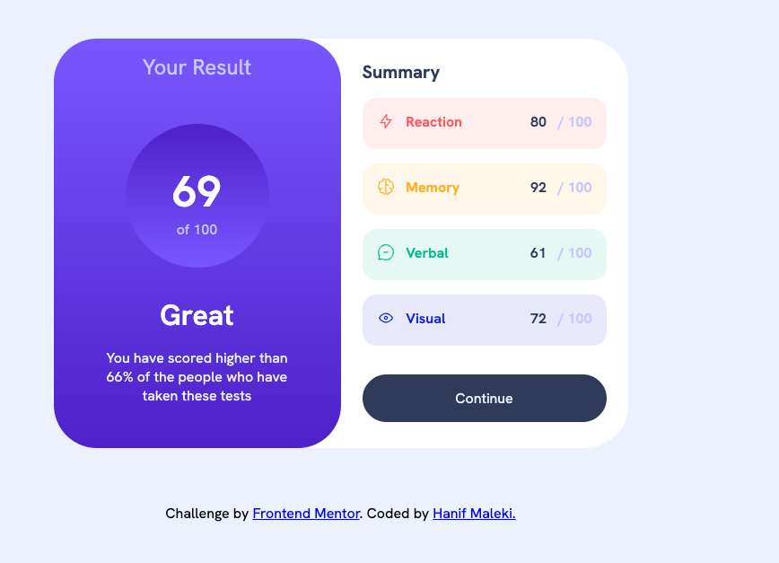

# Frontend Mentor - Results summary component solution

This is a solution to the [Results summary component challenge on Frontend Mentor](https://www.frontendmentor.io/challenges/results-summary-component-CE_K6s0maV). Frontend Mentor challenges help you improve your coding skills by building realistic projects. 

## Table of contents

- [Overview](#overview)
  - [The challenge](#the-challenge)
  - [Screenshot](#screenshot)
  - [Links](#links)
- [My process](#my-process)
  - [Built with](#built-with)
  - [What I learned](#what-i-learned)
  - [Continued development](#continued-development)
- [Author](#author)

## Overview

### The challenge

Users should be able to:

- View the optimal layout for the interface depending on their device's screen size
- See hover and focus states for all interactive elements on the page
- **Bonus**: Use the local JSON data to dynamically populate the content

### Screenshot



### Links

- Solution URL: [Solution URL](https://github.com/hanifmaleki/Result-Summary)
- Live Site URL: [Live site URL](https://hanifmaleki.github.io/Result-Summary)

## My process

### Built with
- Semantic **HTML5** markup  
- **CSS custom properties**  
- **Flexbox**  
- **CSS Grid**  
- **Mobile-first workflow**  
- **Pug** template language  
- **SCSS** (with variables and mixins)  
- **GitHub Actions** (for CI/CD pipeline)  
- **GitHub Pages** (for deployment)  
- **Neovim** (as main editor)  
- **i18 translations**
- **npm scripts** (`watch`, `copy-js`)  

### What I learned

I learned how to use translations instead of hardcoding strings directly in the HTML.  

```js
async function loadTranslation(lang) {
    const res = await fetch(`./js/translate-${lang}.json`)

    return await res.json()
}

function trans(message, parameters) {
    return message.replace(/\{(\w+)\}/g, (_, key) => parameters[key] ?? '')
}

setTranslationAfterCalculations()
    document.querySelector('.quality-title').textContent = this.translations.quality_title
    document.querySelector('.quality-description').textContent = trans(this.translations.quality_description, {percent: 66})
}

initializeAppTranslations() {
    document.querySelector('title').textContent = this.translations.title
    document.querySelector('h1').textContent = this.translations.your_result
    document.querySelector('.result-upper-bound').textContent = this.translations.of_100_text
    document.querySelector('.summary-title').textContent = this.translations.summary
    document.querySelector('#continueButton').textContent = this.translations.continue
}


class Category {
    ...
    translate() {
        this.element.querySelector('.category-title').textContent = this.translations[this.categoryData.category]
        this.element.querySelector('.category-maximum').textContent = this.translations.of_100_sign
    }
}
```

### Continued development
In this project I used a very basic translation system. One reason is that I interpreted the Pug files in a simple way, without integrating translation logic directly into them.
In the next project, I will explore more advanced ways of compiling Pug templates and add support for translation functions in Pug with JavaScript.

Another issue I encountered was that the SCSS watch script did not always work as expected. I plan to debug and improve this setup in my next project.

## Author
- Frontend Mentor - [@hanifmaleki](https://www.frontendmentor.io/profile/hanifmaleki)

